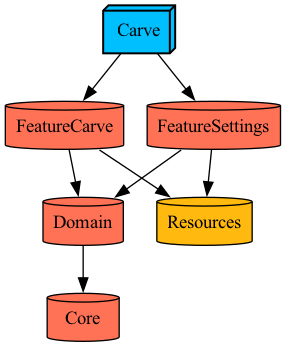

# 📝 성경필사 앱 - 새기다 
[📲 App store Link ](https://apps.apple.com/kr/app/%EC%83%88%EA%B8%B0%EB%8B%A4/id6502980733) 

## 프로젝트 빌드 방법
1. Tuist 설치
    [tuist documents 참고](https://docs.tuist.io/guides/quick-start/install-tuist)
2. Git clone 
3. 터미널에서 클론 받은 경로로 이동 후 tuist install 실행
4. 프로젝트 생성 명렁어 실행 
    4-1. tuist generate로 프로젝트 생성  
    4-2. SwiftUI의 Preview 기능을 사용할 시에는 TUIST_FOR_PREVIEW=TRUE tuist generate 명령어 실행
     단, 이 경우 프로젝트 빌드시 크래시 발생. Preview 이용시에만 사용. 
5. 생성된 xcworkspace 실행

## 아키텍처 
> 모듈화 
 - 비슷한 책임을 가지는 코드를 모듈로 나누었습니다. 
 - MicroFeature를 참고하여 레이어를 구성했습니다. 각 레이어의 역할은 아래 모듈 구조에 작성해두었습니다. 
 - 모듈화 시켜 분리해두었기 때문에 필요한 모듈은 다른 프로젝트에서 재사용할 수 있을 것을 기대합니다.
 
> TCA
 - 단방향 데이터 흐름에 기반한 아키텍처입니다. 이는 데이터 흐름의 추적이 명확해지고 예측 가능해지는 장점이 있습니다.
 - 상태를 관리하는 Reducer와 반영되는 View로 구성되어 코드의 통일성을 가져옵니다. 
 - 기능 단위로 Dependency 객체를 모듈화 할 수 있기 때문에 재사용성이 높아집니다.  

## 모듈 구조
]
- **CarveApp (앱 진입 모듈)** 
     - 화면 모듈 전환: TCA Treebase Navigation으로 Featrue 간 의존성 없이 화면 전환
- **CarveFeature (필사 기능 모듈)**
    - 성경 본문 필사와 관련된 주요 화면(DrawingView, CarveView 등)을 포함합니다.
    - SwiftData 및 CloudKit을 통해 데이터를 처리하고, UI와 상태를 TCA로 연결합니다.
- **SettingsFeature (설정 기능 모듈)**
    - 앱 정보, 기타 설정 기능을 담당하는 View 및 로직을 포함합니다.
- **Domain (비즈니스 로직 모듈)**
    - SwiftData 모델, CloudKit 마이그레이션, 저장소 구성 등 데이터 계층의 핵심 역할을 수행합니다.
    - 각 Feature에서 사용하는 모델과 저장 로직을 이곳에서 정의하고 주입합니다.
- **CarveToolkit (공통 지원 도구 모듈)**
    - Logger, FeatureAction 등 여러 Feature에서 공유하는 보조 유틸리티 코드를 모아둔 모듈입니다.
- **Resources (공통 리소스 모듈)**
    - 색상, 폰트, 이미지 등 앱 전반에서 사용하는 디자인 리소스를 관리합니다.
