# Carve 2.0 UI/UX 디자인 방향과 시안

작성일: 2026-09-10. 현재 저장소 SVG 대조 갱신: 2026-09-10. [2.0.0 로드맵](../release-2.0.0-roadmap.md)의 DESIGN-0·1·2에서 사용할 디자인 검토 문서다. 대화에서 합의한 방향과 제작한 시안을 기록하며, 앱 구현 완료나 실기기 검증을 의미하지 않는다.

**현재 시안의 기준:** `assets/figma/*.svg` 33개가 편집 원본이고, 같은 이름의 `assets/figma-outlined/*.svg` 33개가 Figma 가져오기용이다. [프레임별 미리보기](assets/figma-preview.html)에서 확인한다. `assets/*.svg` 보드는 비교·설명용으로 일부 이전 배치가 남아 있다. 이 문서는 최신 프레임의 구현된 그림, 합의한 제품 동작, 아직 검증하지 않은 동작을 구분한다.

사용자는 SVG를 Figma에 드래그앤드랍했다고 알렸다. **업로드 사실은 사용자 확인이고, Figma 내부의 글꼴·레이어·배치는 직접 검증하지 못했다.** 아래 제작 상태는 저장소 SVG 기준이다.

## 1. 사용자에게 전달할 경험

**말씀을 읽고, 마음에 새기다.** 성경 본문과 나의 필기가 화면의 중심이다. 조작 요소는 쉽게 찾되 필사 공간을 과하게 차지하지 않는다. 종이와 잉크를 연상시키는 색, 읽기 편한 글자, 정돈된 여백으로 차분한 필사 경험을 만든다.

주요 레퍼런스는 [Bear](https://bear.app/)다. 사용자가 선호한 차분한 인상, 낮은 시각적 밀도, 본문 중심의 계층을 참고한다. Bear의 화면을 그대로 복제하는 것이 아니라 Carve의 성경·필기 대응 구조에 적용한다. 레퍼런스 링크는 방향의 출처이며 이 문서 작성 시 사이트를 재조사하지 않았다.

## 2. 합의한 방향

- 원문과 필기 영역을 나란히 유지한다. 본문 개행에 맞춰 필기 가이드도 여러 줄로 제공한다.
- 절 높이는 본문 줄 수와 필요한 필기 공간에 대응한다. 초기 시안의 절당 밑줄 하나와 고정 높이는 최종 방향이 아니다.
- 펜·지우개·올가미·실행 취소·다시 실행은 일관된 선 아이콘으로 표현한다. 선택 상태는 색상 외 배경·형태로도 구분한다.
- 헤더와 사이드바 하단의 조작 버튼도 글자 대신 같은 계열의 선 아이콘으로 둔다. 버튼 자체가 44pt 정사각이라 터치 영역을 따로 넓히지 않는다. 다만 **동작이 아니라 값을 보여주는 자리는 글자로 남긴다** — 번역본 이름이 그 예다.
- 도구 팔레트를 화면 상단에서 하단 중앙으로 옮긴다. 현재 앱은 팔레트가 헤더 안에 있고 그 높이가 `setHeaderHeight` 를 거쳐 본문 상단 여백이 되므로, 위치를 옮기면 이 결합을 함께 끊어야 한다. 세로·좁은 창에서 넘치지 않는 배치를 우선한다.
- 조작 요소는 종이 위에 떠 있는 유리로 표현한다. 본문·필기 영역에는 유리를 쓰지 않는다. 상세는 4장이다.
- 절 롱탭의 `지우기`는 해당 절의 활성 캔버스를 비우고 이전 필사 기록은 보존하는 동작이다. 문구와 시안은 이 제품 의도를 표현하며 저장 구현 완료를 뜻하지 않는다.
- 우선 필사 화면과 탐색을 검토하고, 차트·설정·안내 화면으로 공통 스타일을 확장한다.

## 3. 시각 규격 초안

아래 값은 시안의 출발점이며 최종 디자인 토큰이나 접근성 검증 결과가 아니다.

### 3-1. 색 토큰 — 라이트 · 다크

색은 **컬렉션 하나에 모드 둘**이다. Figma 에서는 변수 컬렉션의 Light · Dark 모드, iOS 에서는 색 에셋 하나의 기본 · Dark 외관 값이 된다. 토큰 이름은 코드의 `Color.Brand` 와 색 에셋 이름에 맞췄다.

| 토큰 | 역할 | 라이트 | 다크 | 쓰는 곳 |
| --- | --- | --- | --- | --- |
| `canvas` | 바탕 | `#FAF9F6` | `#1B1F1D` | 화면 바탕 · 헤더 |
| `surface` | 표면 | `#F0EFEA` | `#2A302D` | 팔레트 · 사이드바 · 팝오버 · 시트 |
| `selected` | 선택 배경 | `#E4EBE2` | `#37443C` | 활성 도구 · 선택한 행 |
| `divider` | 구분선 | `#DFE2DB` | 흰 8% | 표면 안의 구분선 |
| `ink` | 잉크 | `#303B36` | `#E8EAE7` | 글자 · 아이콘 |
| `secondary` | 보조 글자 | `#5F6862` | `#A3ABA5` | 번역본 · 라벨 · 도움말 |
| `accent` | 강조 | `#476550` | `#8FB79A` | 선택 · 링크 · 값 |
| `danger` | 위험 | `#A4453C` | `#E0877C` | 지우기 · 삭제 |
| `scrim` | 가림막 | 잉크 10~20% | 검정 22~30% | 시트 · 팝오버 뒤 |
| `guide` | 필기 줄 | `#DFE2DB` | — (필사 영역 전용) | 필기 가이드 |

펜 기본 3색(`#303B36` · `#476550` · `#9D7967`)은 토큰이 아니다. 사용자가 고르는 필기 색이고 종이 위에만 쓰여 두 모드에서 같다. 어두운 팔레트 위 색 동그라미에는 흰 40% 테두리를 두른다 — 없으면 검정이 1.16:1 로 묻힌다.

**필사 영역은 라이트로 고정한다**(결정 8-1 안 1). 종이 · 원문 · 필기 · 가이드는 다크에서도 라이트 값을 쓴다. Figma 에서는 필사 영역 프레임의 변수 모드를 Light 로 고정하고, iOS 에서는 필사 영역 뷰를 라이트 외관으로 고정한다. PencilKit 은 외관에 따라 잉크 색을 바꿔 보여준다고 알려져 있어 캔버스와 도구 선택기도 라이트로 고정해야 한다 — 구현 전 확인한다. 종이는 배경 장식이라 원문 · 필기 열의 x · 폭은 두 모드에서 같다.

대비는 WCAG 상대 휘도 공식으로 계산했다(실기기 측정 아님). 굵은 값은 4.5:1 미달이다.

| 글자 | 라이트 canvas · surface · selected | 다크 canvas · surface · selected |
| --- | --- | --- |
| `ink` | 11.05 · 10.11 · 9.58 | 13.77 · 11.13 · 8.45 |
| `secondary` | 5.48 · 5.01 · 4.74 | 7.08 · 5.72 · **4.34** |
| `accent` | 6.15 · 5.62 · 5.32 | 7.46 · 6.03 · 4.58 |
| `danger` | 5.71 · 5.22 · 4.94 | 6.29 · 5.08 · **3.86** |

미달 조합은 쓰지 않는다 — `secondary` / `selected` 4.34 · `danger` / `selected` 3.86. 다크에서 `secondary` · `danger` 를 `selected` 위에 두지 않는다. 위험 색이 모드마다 다른 이유도 대비다. 라이트 `#A4453C` 를 다크 표면에 그대로 쓰면 2.24:1 이다.

보조 글자는 초기 시안의 `#727B74` 에서 바꾼 값이다. `#727B74` 는 종이 위 4.15:1, 사이드바 위 3.80:1 로 WCAG AA 에 미달했다. 가이드 `#DFE2DB` 는 종이 위 1.24:1 로, 밝은 곳에서 밑줄이 보이는지 실기기에서 정한다.

**코드와 맞추기.** 지금 코드의 `Color.Brand` 는 1.x 의 크림·금색 계열이다 — `background #F8F4E3` · `cellBackground #F3D4B8` · `ink #171A25` · `secondary #6A6A73` · `accent #D8BC6B`([Color+Extension.swift](../../Supports/CarveToolkit/Sources/Extension/Color+Extension.swift)). 색 에셋에는 Dark 외관 값이 없고 앱은 `UIUserInterfaceStyle: Light` 로 고정돼 있다. `background → canvas`, `cellBackground → surface` 로 이름을 옮기고 `ink` · `secondary` · `accent` 는 값을 바꾸며, `selected` · `divider` · `danger` · `scrim` · `guide` 는 새로 만드는 것을 제안한다. 값이 바뀌므로 지금 Brand 색을 쓰는 차트의 인상도 함께 바뀐다.

규격판은 [디자인 규격 · 다크 모드](assets/design-spec-dark.svg) 다. Figma 규격 보드(3:188) 옆에 붙인다.

### 3-2. 글꼴 · 크기 · 화면

| 항목 | 기본 시안 | 큰 글꼴 시안 |
| --- | --- | --- |
| 성경 본문 | 20pt | 30pt |
| 본문·필기 줄 간격 | 48pt | 64pt |
| 본문 글꼴 | 나눔바른고딕 · 나눔명조 · 나눔꽃향기 중 선택, 기본 나눔바른고딕 | 같음 |
| UI | 시스템 산세리프, 주로 14pt | 같음. 전체 Dynamic Type 설계는 미완료 |
| 필기 예시 | Nanum Pen Script(나눔 펜). 기본 M1·M2는 25.65pt, 일반 필사 예시는 주로 27pt | 실제 PencilKit 획이 아닌 시각 샘플 |
| 도구 | 24pt 아이콘 · 1.7pt 선 · 최소 44pt 터치 영역 | 같음 |
| 화면 | 가로 1180 × 820, 세로 820 × 1180 | 가로 1180 × 820 |

**두 열은 별도 모드가 아니라 본문 설정의 두 지점이다.** 본문 20pt 는 기본값이고 30pt 는 같은 슬라이더의 위쪽이다(6-2 안 D).

앱에 번들된 본문 글꼴은 나눔 3종이다. SVG 시안은 렌더 환경 때문에 Noto · Apple SD Gothic 계열로 그렸으므로 글꼴 인상은 구현과 다를 수 있다. 구현용 글꼴 번들·라이선스 확인은 별도 작업이다. SVG 픽셀 크기는 시안 좌표이며 실제 앱에서 pt 와 화면 배율을 구분한다.

## 4. 재질과 Liquid Glass

종이와 잉크 위에 조작 요소만 유리로 띄운다. 본문·필기 가이드·필사 배경은 유리를 쓰지 않는다 — 필사 내용이 다른 표면의 배경이 되면 읽기와 쓰기를 모두 방해한다.

| 유리로 만든다 | 유리로 만들지 않는다 |
| --- | --- |
| 도구 팔레트, 탐색 오버레이(사이드바·장 컬럼), 장 선택 팝오버, 헤더 버튼(서재 · 이전 장 · 다음 장 · 본문 설정) | 종이 배경, 성경 본문, 필기 가이드, 지우기 확인처럼 대비가 우선인 확인 화면 |

### 4-1. 팔레트 접기와 펼치기

- 상태는 둘이다. **펼침** — 현재 시안의 504 × 64 가로 팔레트. **접힘** — 64pt 원형 도구 버튼과 그 옆의 44pt 실행 취소 버튼. 오른손 모드에서는 좌측 하단, 왼손 모드에서는 우측 하단에 놓는다.
- 접히는 조건은 **시간이 아니라 사용자 동작에 붙인다**(2026-09-10 결정). 본문을 읽어 내려가는 스크롤에서 접히고, 되돌리는 스크롤에서 다시 펼친다. 시간 기반 자동 접힘은 넣지 않는다 — 잠깐 생각한 뒤 도구를 바꾸려 할 때 이미 접혀 있으면 번거롭다.
- 스크롤 방향은 손가락이 아니라 **본문이 나아가는 방향**으로 정의한다. 필사 화면의 스크롤 수단은 두 손가락 스크롤 하나뿐이라(`pencilOnly`) 판정이 단순하다.
- 펼치는 조건: 접힘 버튼 탭. Apple Pencil이 화면에 닿을 때 자동으로 펼치지는 않는다 — 필기를 시작하는 순간 팔레트가 커지면 방해가 된다.
- 접힘 버튼은 현재 도구와 색을 아이콘으로 보여준다. 접힌다고 선택 상태를 잃지 않는다.
- 좌측 하단에 두는 이유는 오른손 필기 영역(오른쪽 열)에서 가장 먼 자리이기 때문이다. 앱에는 이미 `isLeftHanded` 설정이 있고 이 값이 원문·필기 열 순서를 바꾸므로(`VerseRowView` · `SentencesWithDrawingView`), 접힘 버튼도 같은 값을 따라 반대쪽 하단으로 간다.
- 접힘 버튼은 스크롤하는 본문 위에 떠 있고 본문이 그 아래로 지나간다. 초기 `c3`에서는 원문 마지막 줄과 겹쳤다. 현재 프레임은 도구 위에 본문 표시가 끝나지만 정적 그림만으로 마지막 줄 스크롤 도달을 보장할 수 없다. 구현에서는 마지막 줄을 버튼보다 위로 올릴 수 있도록 바닥 여백을 둔다.
- **현재 SVG는 접힘 상태에도 실행 취소를 별도 44pt 버튼으로 남겼다.** 실행 취소는 한 번 탭, 다시 실행은 팔레트를 펼친 뒤 탭하는 배치다. 실제 비활성 상태와 터치 접근성은 구현 시 확인한다.
- 접기·펼치기는 두 모양 사이의 morph 로 다룬다. 서로 다른 두 요소가 아니라 같은 요소의 두 상태로 본다.

**구현 상태 (2026-09-11).** 팔레트는 헤더의 연필 버튼과 높이 측정에서 분리해 화면 하단 오버레이로 옮겼다. 기본은 접힘이며 현재 도구 64pt 버튼과 실행 취소 44pt 버튼을 남긴다. 오른손 모드는 좌측 하단, 왼손 모드는 우측 하단이다. 본문을 읽어 내려가면 접고 되돌리면 펼치며, 접힌 도구 버튼을 탭해도 펼친다. 일반 스크롤과 단일 Canvas 모두 마지막 절 아래에 팔레트 높이만큼 여백을 둔다.

### 4-2. 배포 타깃 (확인한 사실)

현재 배포 타깃은 iOS 17.0 이다([Target+Templates.swift](../../Plugins/ProjectDescriptionHelpers/Target+Templates.swift)). Liquid Glass API 는 iOS 26 이상이다.

**배포 타깃은 올리지 않고 `#available` 분기로 간다.** iPadOS 18 사용자가 있다는 사용자 확인에 따른 결정이다(2026-09-10). 앱은 이미 Apple Pencil 더블탭에서 `#available(iOS 17.5, *)` 분기를 쓰고 있어 같은 방식을 쓴다.

분기로 가면 유리를 쓰는 화면과 쓰지 않는 화면이 **둘 다 출시된다.** 따라서 폴백은 "유리가 빠진 모습"이 아니라 그 자체로 완성된 화면이어야 한다. 두 경로에서 정해야 할 것은 다음과 같다.

| 요소 | iOS 26 이상 | iOS 26 미만 |
| --- | --- | --- |
| 도구 팔레트 | 유리 + 접기·펼치기 morph | 불투명 표면(`#F0EFEA`). 접기·펼치기를 유지할지, 항상 펼침으로 둘지 정한다 |
| 탐색 오버레이·팝오버 | 유리 | 불투명 표면. 뒤 화면은 scrim 으로 구분한다 |
| 헤더 버튼 | 유리 | 현재의 `#F0EFEA` pill |

접기·펼치기 동작 자체는 유리와 무관하므로 두 경로에서 같게 두는 것을 우선한다. 전환 애니메이션만 morph 와 단순 페이드로 갈린다. 분기 지점을 화면마다 흩지 않고 표면 컴포넌트 한 곳에 모은다.

### 4-3. 접근성

- 투명도 줄이기·대비 늘리기가 켜지면 유리 대신 불투명 표면(`#F0EFEA`)으로 떨어진다. 시스템이 자동으로 처리하는 범위와 직접 처리할 범위를 구분해 확인한다.
- 유리 위 글자의 대비는 뒤에 오는 필사 내용에 따라 달라진다. 3장의 대비 값은 불투명 배경 기준이며, 짙은 필기 위에 팔레트가 놓인 최악의 경우를 따로 확인한다.
- 팔레트가 접히면 도구 전환이 두 단계가 된다. VoiceOver 에서 접힘 버튼이 현재 도구를 읽어야 하고, 접힘·펼침이 상태 변화로 전달되어야 한다.
- 동작 줄이기에서 morph 전환을 어떻게 대체할지 정한다.

이 장은 방향이며 실제 API 동작·성능·PencilKit 캔버스 위에서의 유리 렌더 비용을 확인한 결과가 아니다.

## 5. 탐색 구조

가로는 현재 앱의 3-column `NavigationSplitView` 를 유지하고, 세로는 장 선택만 헤더 팝오버로 분리한다.

**폭이 변하지 않는 것이 이 화면의 제약이다.** 사이드바가 필사 열을 밀면 회전과 같은 자극이 되어 [단일 Canvas 설계](../single-canvas-design.md)의 reflow 와 D6(회전·리사이즈 시 표시 어긋남)를 건드린다. 현재 코드는 이미 `.prominentDetail` 을 쓰고 있고, 이 스타일은 leading 컬럼을 보이거나 숨길 때 detail 크기를 유지하려 한다.

| 방식 | 한 화면에 보이는 장 | 시편 150장 |
| --- | --- | --- |
| 현재 앱 (장 목록이 리스트) | 약 17 | 8.8 화면 |
| 가로 · 3-column 오버레이 + 5열 그리드 | 약 65 | 2.3 화면 |
| 세로 · 헤더 팝오버 + 10열 그리드 | 약 100 | 1.5 화면 |

행 수는 navigationTitle 표시 방식과 검색 배치에 따라 달라지는 추정이며 실제 화면에서 다시 센다.

- 장 목록을 리스트에서 그리드로 바꾼다. 컬럼 폭이 150~350pt 로 가변이므로 열 수가 폭에 따라 접히는 방식이어야 한다.
- 사이드바를 열어도 필사 화면을 다른 뷰로 교체하지 않는다. 현재 `CarveNavigationView` 는 사이드바가 열리면 detail 을 회색 `Color` 로 바꾸는데, 그 회색이 실제로 하는 일은 탭하면 닫히는 dismiss scrim 이다. 살아 있는 detail 위에 덮는 방식으로 옮기면 사이드바를 여닫을 때마다 `CarveDetailView` 가 트리에서 빠졌다 다시 붙는 왕복이 사라진다.
- 세로에서 600pt 오버레이는 820pt 화면에 과하다. 사이드바는 성경만 덮고 장은 헤더 제목 팝오버에서 고른다.
- 검색은 성경과 장을 함께 받는다. 계층을 거치지 않는 가장 짧은 경로다.

**구현 상태 (2026-09-11).** 가로 `NavigationSplitView`는 상세 화면을 회색 화면으로 교체하지 않고 유지한 채 탐색 열을 표시한다. 성경 열에는 검색·구약/신약 전환·선택 상태·차트/설정 아이콘을, 장 열에는 현재 장이 가운데로 이동하는 44pt 5열 그리드를 적용했다. 세로 헤더 팝오버는 별도 적응 작업으로 남아 있다.

**확인하지 않은 것.** `.prominentDetail` 의 폭 유지는 "유지하려 한다"는 서술이며 보장이 아니다. 가로·세로 실기기에서 사이드바를 여닫으며 필기 열 폭이 상수인지 실측해야 하고, 특히 세로에서 다르게 동작할 가능성이 있다. detail 을 살려 두면 장을 고르는 동안 이전 장의 캔버스가 메모리에 남으므로 긴 장(시편 119편)에서 다시 잰다.

## 6. 시안

### 6-1. 파일 목록

[전체 미리보기 HTML](assets/index.html) 을 브라우저에서 열면 보드를 순서대로 볼 수 있다.

**보드** — `assets/*.svg`. 한 파일에 프레임 여럿과 캡션이 들어 있다.

| 파일 | 담긴 화면 | 상태 |
| --- | --- | --- |
| [base-writing-option-m.svg](assets/base-writing-option-m.svg) | 기본 필사 안 M — 세로 · 가로 | **기준 화면** |
| [nav-option-c-glass.svg](assets/nav-option-c-glass.svg) | 탐색 안 C — 가로 3-column 오버레이 · 세로 헤더 팝오버 · 가로 축소 팔레트 | **채택** (5장) |
| [text-settings-option-d.svg](assets/text-settings-option-d.svg) | 본문 설정 안 D — 본문 설정 팝오버 · 왼손 사용자용 화면 | |
| [history-popover-option-e.svg](assets/history-popover-option-e.svg) | 이전 필사 안 E — 절 롱탭 메뉴 · 기록 팝오버 · 빈 상태와 손상된 회차 | |
| [image-widget-option-g.svg](assets/image-widget-option-g.svg) | 이미지·위젯 안 G — 절 이미지 · 저장 결과 셋 · 위젯 지정 확인 · 위젯 라이트/다크 | |
| [app-settings-option-f.svg](assets/app-settings-option-f.svg) | 앱 설정 안 F — 설정 시트 · 모든 필사 데이터 삭제 확인 | |
| [chart-option-h.svg](assets/chart-option-h.svg) | 차트 안 H — 차트 화면 · 빈 상태와 접근성 요약 | |
| [help-patchnote-option-i.svg](assets/help-patchnote-option-i.svg) | 도움말 안 I — 최초 진입 안내 · 패치노트 · 설정 안 도움말 | |
| [dark-paper-option-j.svg](assets/dark-paper-option-j.svg) | 다크 모드 안 J — 라이트·다크 비교 · 필사 화면 · 탐색 열림 · 본문 설정 | **채택** (8-1) |
| [ads-option-k.svg](assets/ads-option-k.svg) | 광고 안 K — 자리 지도 · 헤더 줄 광고 · 사이드바 하단 광고 · 상태와 광고 제거 | 사이드바만 채택 (8-2) |
| [header-collapse-option-l.svg](assets/header-collapse-option-l.svg) | 헤더 축소 안 L — 헤더 펼침 · 헤더 축소 · 두 상태 규칙 | **채택** (8-4) |
| [design-spec-dark.svg](assets/design-spec-dark.svg) | 디자인 규격 · 다크 모드 — 색 토큰 · 라이트 고정 영역 · 대비 · 코드 대응 | 값은 3-1 과 같다 |
| [header-icons.svg](assets/header-icons.svg) | 아이콘 스펙 — 실제 크기 · 3배 확대 · 상태 셋 · VoiceOver 이름 | |
| [nav-option-a-overlay.svg](assets/nav-option-a-overlay.svg) | 탐색 안 A — 오버레이 400pt 사이드바 + 성경→장 push | 채택 안 함. 3-column 이 더 적은 변경으로 같은 결과를 낸다 |
| [nav-option-b-popover.svg](assets/nav-option-b-popover.svg) | 탐색 안 B — 성경 전용 사이드바 320pt + 헤더 팝오버 | 팝오버만 안 C 의 세로 화면으로 옮겼다 |
| [large-type.svg](assets/large-type.svg) | 큰 글꼴 필사 (초기) | 대체됨 — 팔레트가 아직 상단이다 |
| [navigation-split.svg](assets/navigation-split.svg) | 성경·장 선택 (초기) | 대체됨 — 줄 간격 44pt · 목록 행 40pt · 옛 보조 글자 색 |

**Figma 임포트용** — `assets/figma/*.svg`. 프레임 하나가 파일 하나이고 원점이 0,0 이며 `<use>` · 필터를 쓰지 않아 임포트가 예측 가능하다.

| 파일 | 프레임 | 크기 |
| --- | --- | --- |
| [c1-landscape-3col.svg](assets/figma/c1-landscape-3col.svg) | 가로 3-column 오버레이 | 1180 × 820 |
| [c2-portrait-popover.svg](assets/figma/c2-portrait-popover.svg) | 세로 헤더 팝오버 | 820 × 1180 |
| [c3-landscape-mini-palette.svg](assets/figma/c3-landscape-mini-palette.svg) | 가로 축소 팔레트 | 1180 × 820 |
| [d1-text-settings-popover.svg](assets/figma/d1-text-settings-popover.svg) | 본문 설정 팝오버 | 1180 × 820 |
| [d2-left-handed.svg](assets/figma/d2-left-handed.svg) | 왼손 사용자용 화면 | 1180 × 820 |
| [d3-left-text-settings.svg](assets/figma/d3-left-text-settings.svg) | 왼손 모드 · 본문 설정 열림 | 1180 × 820 |
| [e1-verse-menu.svg](assets/figma/e1-verse-menu.svg) | 절 롱탭 메뉴 | 1180 × 820 |
| [e2-history-popover.svg](assets/figma/e2-history-popover.svg) | 이전 필사 기록 팝오버 | 1180 × 820 |
| [e3-history-states.svg](assets/figma/e3-history-states.svg) | 빈 상태 · 손상된 회차 | 1180 × 320 |
| [f1-app-settings.svg](assets/figma/f1-app-settings.svg) | 앱 설정 | 1180 × 820 |
| [f2-delete-confirm.svg](assets/figma/f2-delete-confirm.svg) | 삭제 확인 | 1180 × 820 |
| [g1-verse-image.svg](assets/figma/g1-verse-image.svg) | 저장되는 절 이미지 | 1180 × 820 |
| [g2-save-results.svg](assets/figma/g2-save-results.svg) | 저장 결과 셋 | 1180 × 360 |
| [g3-widget-assign.svg](assets/figma/g3-widget-assign.svg) | 위젯 지정 확인 | 1180 × 820 |
| [g4-widget-light-dark.svg](assets/figma/g4-widget-light-dark.svg) | 위젯 라이트 · 다크 | 1180 × 420 |
| [h1-chart.svg](assets/figma/h1-chart.svg) | 차트 | 1180 × 820 |
| [h2-chart-states.svg](assets/figma/h2-chart-states.svg) | 빈 상태 · 접근성 요약 | 1180 × 420 |
| [i1-first-run-hint.svg](assets/figma/i1-first-run-hint.svg) | 최초 진입 안내 | 1180 × 820 |
| [i2-patchnote.svg](assets/figma/i2-patchnote.svg) | 패치노트 | 1180 × 820 |
| [i3-help.svg](assets/figma/i3-help.svg) | 도움말 | 1180 × 820 |
| [j1-dark-writing.svg](assets/figma/j1-dark-writing.svg) | 필사 화면 · 다크 | 1180 × 820 |
| [j2-dark-navigation.svg](assets/figma/j2-dark-navigation.svg) | 탐색 열림 · 다크 | 1180 × 820 |
| [j3-dark-text-settings.svg](assets/figma/j3-dark-text-settings.svg) | 본문 설정 · 다크 | 1180 × 820 |
| [k1-ad-zones.svg](assets/figma/k1-ad-zones.svg) | 광고 자리 지도 | 1180 × 820 |
| [k2-header-banner.svg](assets/figma/k2-header-banner.svg) | 헤더 줄 광고 | 1180 × 820 |
| [k3-sidebar-native-ad.svg](assets/figma/k3-sidebar-native-ad.svg) | 사이드바 하단 광고 | 1180 × 820 |
| [k4-ad-states.svg](assets/figma/k4-ad-states.svg) | 광고 상태 · 광고 제거 | 1180 × 420 |
| [l1-header-expanded.svg](assets/figma/l1-header-expanded.svg) | 헤더 펼침 | 1180 × 820 |
| [l2-header-compact.svg](assets/figma/l2-header-compact.svg) | 헤더 축소 | 1180 × 820 |
| [l3-header-rules.svg](assets/figma/l3-header-rules.svg) | 헤더 두 상태 규칙 | 1180 × 420 |
| [m1-base-portrait.svg](assets/figma/m1-base-portrait.svg) | 기본 필사 · 세로 | 820 × 1180 |
| [m2-base-landscape.svg](assets/figma/m2-base-landscape.svg) | 기본 필사 · 가로 | 1180 × 820 |
| [spec-dark-mode.svg](assets/figma/spec-dark-mode.svg) | 디자인 규격 · 다크 모드 | 1180 × 2274 |

**아이콘 낱장** — `assets/*.svg`, 24 × 24.

| 자리 | 파일 |
| --- | --- |
| 도구 팔레트 | [pen](assets/pen.svg) 펜 · [eraser](assets/eraser.svg) 지우개 · [lasso](assets/lasso.svg) 올가미 · [undo](assets/undo.svg) 실행 취소 · [redo](assets/redo.svg) 다시 실행 |
| 헤더 | [library](assets/library.svg) 서재 · [prev](assets/prev.svg) 이전 장 · [next](assets/next.svg) 다음 장 · [textformat](assets/textformat.svg) 본문 설정 |
| 사이드바 하단 | [chart](assets/chart.svg) 차트 · [settings](assets/settings.svg) 설정 |

### 6-2. 화면별 메모

#### 기본 필사 화면 — 안 M

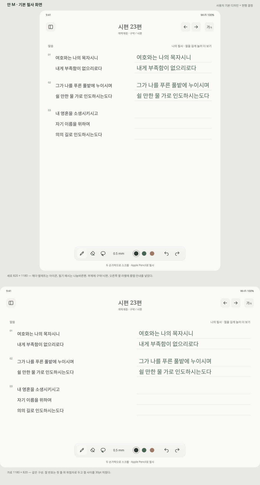

[SVG 원본](assets/base-writing-option-m.svg). 두 프레임이다 — 세로 820 × 1180, 가로 1180 × 820. 사용자가 준 기본 필사 디자인에 지금까지의 결정을 얹은 것이며, 다른 안들이 변형해 쓰는 기준 화면이다.

기본 디자인에서 가져온 것 — 부제에 `개역한글 · 구약 / 시편` 을 함께 적고, 오른쪽 열 라벨을 `나의 필사 · 절을 길게 눌러 더 보기` 로 두어 롱탭을 그 자리에서 알린다. 절 번호는 첫 줄 위 위첨자로 올리고 절 사이를 30pt 띄운다.

현행 결정에서 얹은 것 — 헤더와 팔레트를 글자에서 아이콘으로, 팔레트를 하단 중앙 유리로, 필기 예시를 펜 글꼴로 바꿨다. 본문은 개역한글 표기대로 `쉴 만한 물 가으로` 로 적었다.

**필기 예시 글꼴.** 현재 원본은 `Nanum Pen Script, Nanum Pen, cursive`를 지정하며, 가져오기용은 동봉한 Nanum Pen Script 파일에서 실제 글리프 윤곽선을 생성했다. 나눔바른펜을 쓴 이전 시안은 대체됐다. UI·성경 원문은 텍스트로 유지한다. 실제 앱의 필기는 PencilKit 획이므로 시안 전용 손글씨 글꼴을 앱에 추가할 필요는 없다. 기본 프레임은 [세로 M1](assets/figma-outlined/m1-base-portrait.svg) · [가로 M2](assets/figma-outlined/m2-base-landscape.svg)다.

#### 탐색 — 안 C

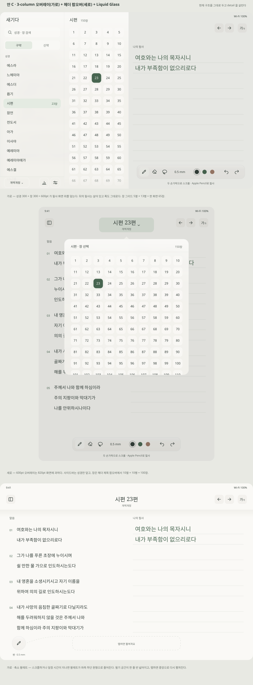

[SVG 원본](assets/nav-option-c-glass.svg). 세 프레임이다 — 가로 3-column 오버레이, 세로 헤더 팝오버, 가로 축소 팔레트.

**장 그리드는 현재 장이 보이는 위치에서 시작한다.** 시편 119편에서 열면 119 가 화면 안에 있어야 한다. 가로 사이드바와 세로 팝오버 모두 같다. 세로 팝오버는 101 이후가 이어진다는 표시가 이미 있다(11행이 잘려 보인다). 바깥 탭 외에 명시적 닫기를 둘지, 큰 UI 글자에서 열 수를 줄일지는 정한다. 세 안 모두 보조 글자를 `#5F6862` 로, 성경 목록 행을 44pt 로, 줄 간격을 48pt 로 그렸다.

**유리 표현은 근사다.** SVG 에는 backdrop blur 가 없어 뒤 콘텐츠를 블러로 한 겹 복제해 깔고 반투명 틴트·상단 스펙큘러·림 라이트를 올렸다. 실제 Liquid Glass 재질과 다르고, 굴절·반사·상태 전환은 표현하지 않는다.

현재 가로 탐색 C1과 다크 탐색 J2는 오버레이에 반쯤 가려지던 상세 제목·번역본을 숨긴다. 상세 폭은 바꾸지 않고 현재 장은 탐색 목록의 선택으로 표시한다. 광고 배치를 유지한 K3는 별도 시안이며 같은 헤더 숨김 수정이 적용되지 않았다. 축소 팔레트 C3는 64pt 도구 버튼과 44pt 실행 취소를 보여준다. 정적 배치와 별개로 마지막 줄이 가려지지 않는 스크롤 여백을 구현에서 확인한다.

#### 본문 설정 — 안 D

현재 [SentenceSettingsView](../../Feature/CarveFeature/Sources/Presentation/Header/SentenceSettings/SentenceSettingsView.swift) 는 헤더 버튼으로 여는 `Form` 시트이고, 맨 위에 300pt 짜리 `예시 문구` 섹션(요한복음 3:16)이 있다. **시트가 본문을 덮기 때문에** 미리보기용 샘플 문장이 따로 필요했던 것이다.

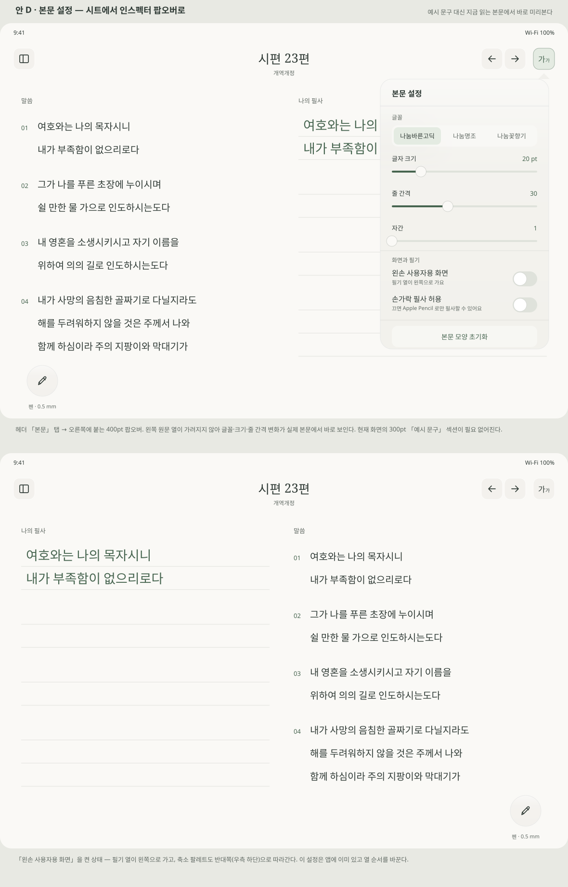

현재 [D1 프레임](assets/figma-outlined/d1-text-settings-popover.svg)은 헤더 `본문` 버튼에 붙는 오른쪽 **350 × 560pt** 팝오버다. 배경 가림막을 없애 원문과 노출된 필기 영역에서 설정 결과를 확인하는 방향이다. 별도 `예시 문구` 섹션은 두지 않는다. [비교 보드](assets/text-settings-option-d.svg)의 이전 설명과 차이가 나면 D1을 기준으로 한다.

팝오버 안 항목은 현재 화면과 같다. 소스에서 확인한 값이다.

| 항목 | 값 |
| --- | --- |
| 글꼴 | 나눔바른고딕(기본) · 나눔명조 · 나눔꽃향기 — `Domain.FontCase` |
| 글자 크기 | 15 ~ 40, 기본 20 |
| 줄 간격 | 5 ~ 70, 기본 30 |
| 자간 | 1 ~ 10, 기본 1 |
| 왼손 사용자용 화면 | 원문·필기 열 순서를 바꾼다 |
| 손가락 필사 허용 | `PKCanvasView.drawingPolicy` 를 `.anyInput` / `.pencilOnly` 로 바꾼다 |

`본문 모양 초기화`(이전 이름: `기본값으로 되돌리기`)는 **새 제안**이다. 슬라이더 셋을 만진 뒤 처음 상태로 못 돌아가는 문제를 막는 것이며 현재 앱에는 없다. 되돌리는 범위는 **글꼴·크기·줄 간격·자간까지**다. 왼손 사용자용 화면과 손가락 필사 허용은 입력 방식이라 건드리지 않는다.

**고친 것.** 가림막을 없애고 팝오버를 350 × 560 으로 줄여 오른쪽 끝에 붙였다. 필기 열이 보이는 폭이 120pt 에서 170pt 로 늘었고 팝오버 아래로 절이 더 보인다.

**왼손 모드에서는 `본문 설정` 버튼과 팝오버가 함께 왼쪽으로 간다.** 왼손 모드는 원문을 오른쪽에 두므로 오른쪽 팝오버가 미리보기 대상을 덮는다. 반대로 옮기면 팝오버가 필기 열을 덮고 원문이 온전히 보인다.

**사이드바는 옮기지 않는다.** `NavigationSplitView` 는 leading 컬럼만 제공하고 trailing 사이드바 API 가 없다. 레이아웃 방향을 통째로 뒤집는 우회는 본문 정렬·제스처·스크롤까지 함께 뒤집혀 쓸 수 없다. 그래서 **버튼 위치는 무엇에 묶여 있는지로 정한다** — `서재` 는 사이드바가 나오는 쪽이라 왼쪽 고정, `본문 설정` 은 덮어도 되는 열(필기 열) 쪽, `이전 장`·`다음 장` 은 아무 데도 묶이지 않으므로 그대로 둔다. 왼손 모드에서 사이드바가 필기 열을 덮는 것은 말씀이 계속 보인다는 뜻이라 문제가 아니다.

[D2](assets/figma-outlined/d2-left-handed.svg)는 왼손 기본 화면이고 [D3](assets/figma-outlined/d3-left-text-settings.svg)는 왼손 본문 설정을 연 화면이다. 서재 버튼은 x=28, 본문 설정 버튼은 x=84에 두며 팝오버도 x=84에서 열린다. 오른쪽 원문을 유지하고, 이전·다음 버튼은 오른쪽에 남긴다. 축소 팔레트와 실행 취소는 우측 하단이다. 팝오버가 열린 상태에서 왼손 설정을 바꿀 때의 전환은 정적 SVG에 구현되지 않았다.

**헤더 버튼 이름을 정리했다.** 시안의 헤더 오른쪽 끝은 `설정` 이 아니라 `본문` 이다. 앱 전체 설정은 사이드바 하단의 `설정` 이고, 헤더의 것은 이 본문 표시 설정이다. 현재 앱 헤더에는 연필 설정 버튼과 문장 설정 버튼이 따로 있는데, 연필 쪽은 4-1 의 접힘 버튼이 역할을 가져간다.

#### 이전 필사 기록 — 안 E

절을 길게 누르면 나오는 `이전 필사 내용 보기` 는 지금 [`.sheet`](../../Feature/CarveFeature/Sources/Presentation/Drawing/SentenceWithDrawing/SentencesWithDrawingView.swift) 로 [VerseDrawingHistoryView](../../Feature/CarveFeature/Sources/Presentation/Drawing/VerseDrawingHistory/VerseDrawingHistoryView.swift) 를 띄운다.

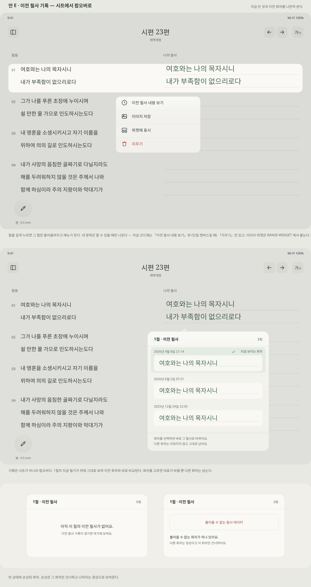

[SVG 원본](assets/history-popover-option-e.svg). 세 프레임이다 — 절 롱탭 메뉴, 기록 팝오버, 빈 상태와 손상된 회차.

**시트를 팝오버로 바꾼다.** 이 화면의 목적은 지금 쓴 것과 이전 회차를 견주는 것인데, 시트는 지금 것을 덮는다. 팝오버를 절 아래에 두면 그 절의 현재 필기가 위에 그대로 남는다.

소스에서 확인한 동작과, 그에 따라 시안에서 고친 것이다.

| 확인한 동작 | 시안에서 |
| --- | --- |
| 회차를 고르면 `updatePresentDrawing` 이 `isPresent` 를 옮긴다. 덮어쓰기가 아니라 **대표 회차 전환**이고 다른 회차는 남는다 | "불러오기" 가 아니라 고르면 바로 바뀌는 것으로 뒀다. 되돌릴 수 있으므로 확인 단계를 넣지 않았다 |
| 그런데 현재 화면은 `isPresent` 를 **표시하지 않는다.** 목록만 봐서는 어느 회차가 지금 보이는 것인지 알 수 없다 | 현재 회차에 체크와 `지금 보이는 회차` 배지를 넣고 행 배경으로도 구분했다 |
| 미리보기가 `pkDrawing.bounds` 를 그대로 `frame` 에 넣는다. 긴 절은 팝오버를 넘고 짧은 절은 아주 작게 나온다 | 썸네일을 고정 폭에 맞춰 비율을 지키며 줄이는 것으로 뒀다 |
| 빈 행은 `historyRows()` 가 목록에서만 거른다 (UI-2 후속) | 빈 상태는 회차 0개로 따로 그렸다 |
| 롱탭 메뉴의 `지우기` 는 단일 캔버스 경로에서만 붙는다 ([ChapterCanvasController](../../Feature/CarveFeature/Sources/Presentation/Drawing/ChapterCanvas/ChapterCanvasController.swift)) | 메뉴 시안에 함께 그렸고, 조건부라는 것을 캡션에 적었다 |

메뉴는 네 항목이다 — `이전 필사 내용 보기` · `이미지 저장` · `위젯에 표시` · `지우기`. [로드맵 §3-2](../release-2.0.0-roadmap.md) 의 범위이며, 현재 코드에는 첫 항목과 (단일 캔버스일 때) 마지막 항목만 있다. 나머지 둘은 IMAGE · WIDGET 에서 붙는다. 항목은 할 수 있을 때만 노출하고 둘 다 없으면 메뉴를 띄우지 않는다(UI-2 결정). `삭제` 가 아니라 `지우기` 인 것도 UI-2 에서 정한 것으로, 현재 필사를 보관 행으로 남기고 활성 캔버스만 비운다.

**탭이 곧 대표 회차 전환이다**(2026-09-10 결정). 미리보기 단계를 따로 두지 않고, 되돌릴 수 있는 동작이라 확인 단계도 넣지 않는다. 다만 메뉴 항목 이름이 `이전 필사 내용 보기` 라 탭의 결과와 어긋날 수 있으므로, 이름을 `이전 필사` 로 줄이는 것을 함께 검토한다.

시안의 썸네일 셋이 모두 같은 한 줄이라 회차 사이의 차이가 드러나지 않는다. 짧은 절·긴 절·부분 필사를 섞어 다시 그린다.

#### 이미지 저장 · 위젯에 표시 — 안 G

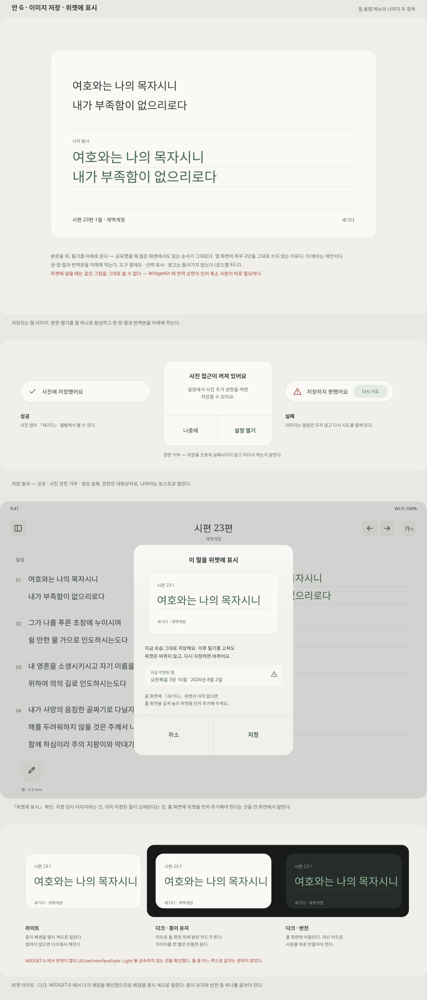

[SVG 원본](assets/image-widget-option-g.svg). 네 프레임이다 — 저장되는 절 이미지, 저장 결과 셋, 위젯 지정 확인, 위젯 라이트·다크.

**절 이미지는 본문을 위, 필기를 아래로 둔다.** 앱 화면의 좌우 2단을 그대로 쓰지 않는 이유는, 공유했을 때 좁은 화면에서 두 열이 각각 절반으로 줄어 읽기 어려워지기 때문이다. 위아래로 두면 읽는 순서가 그대로다. 이 배치는 제안이다. 권·장·절과 번역본을 아래에 적고 도구 팔레트·선택 표시·광고는 넣지 않는다.

저장 결과는 셋이다. 성공과 실패는 토스트로, 사진 권한 거부는 대화상자로 알린다 — 권한은 사용자가 어디서 켜는지 알아야 하므로 지나가는 알림으로 두지 않는다.

위젯 지정 확인은 세 가지를 한 화면에서 말한다.

- 지금 모습 그대로 저장하며 이후 필기를 고쳐도 위젯은 바뀌지 않는다.
- 이미 지정된 절이 있으면 교체된다. 그 절과 지정 날짜를 보여준다.
- **홈 화면에 위젯이 아직 없으면 먼저 추가해야 한다.** 앱 메뉴는 표시 대상을 정할 뿐이므로 홈 화면에 자동으로 추가됐다고 안내하지 않는다(로드맵 §3-2).

**위젯 다크 모드는 WIDGET-0 에서 확인한 위험이다.** 위젯은 앱의 `UIUserInterfaceStyle: Light` 를 상속하지 않으므로 배경을 명시 색으로 칠해야 한다([위젯 위험 확인](../widget-feasibility.md) §4). 시안에 두 방향을 나란히 뒀다 — 종이 유지와 어두운 반전. **종이 유지로 정했다**(8-1 과 한 몸, 2026-09-10). 이미지를 한 벌만 만들면 되고 다크 모드 결정과도 어긋나지 않는다.

또 하나, **위젯에는 사진 저장용 원본을 그대로 줄 수 없다.** WidgetKit 에 이미지 면적 상한이 있어 초과하면 앱은 정상인데 위젯만 조용히 플레이스홀더가 된다([위젯 위험 확인](../widget-feasibility.md) §2). IMAGE-CORE 가 위젯용 축소 사본을 함께 만들지 정해야 한다.

#### 앱 설정 — 안 F

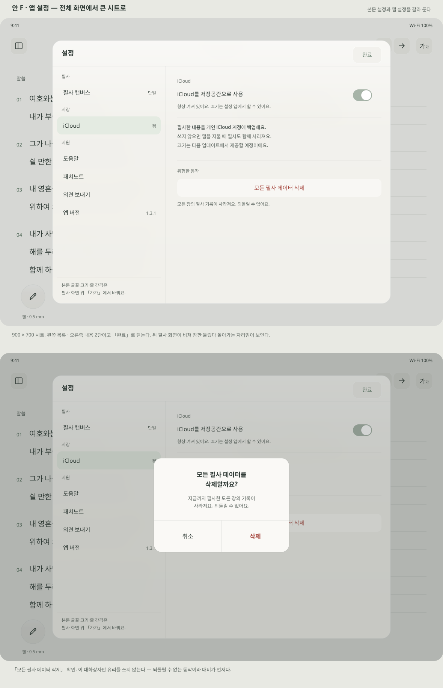

[SVG 원본](assets/app-settings-option-f.svg). 현재 [SettingsView](../../Feature/SettingsFeature/Sources/Setting/SettingsView.swift) 는 `NavigationSplitView` 를 전체 화면으로 띄우고 `toolbar(.hidden)` 뒤에 X 버튼을 따로 얹는다. 900 × 700 시트로 줄이고 `완료` 로 닫는다. 뒤 필사 화면이 비쳐 잠깐 들렀다 돌아가는 자리임이 보인다.

목록은 현재의 `앱 설정` · `지원` 두 묶음을 `필사` · `저장` · `지원` 셋으로 나눴다. 항목 자체는 그대로다 — 필사 캔버스, iCloud, 의견 보내기, 앱 버전. 오른쪽 끝은 설명이 아니라 현재 값을 적는다.

**본문 설정은 여기 넣지 않는다.** 글꼴·크기·줄 간격은 필사 화면 헤더의 `가가` 에 있다. 대신 설정에서 찾는 사람을 위해 목록 아래에 어디 있는지 적는 줄을 뒀다 — **새 제안**이다.

`모든 필사 데이터 삭제` 확인 대화상자만 유리를 쓰지 않는다. 되돌릴 수 없는 동작이라 4장의 규칙대로 대비가 먼저다.

#### 차트 — 안 H

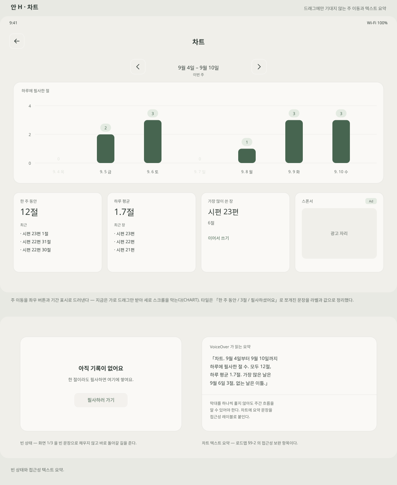

[SVG 원본](assets/chart-option-h.svg). 두 프레임이다 — 차트 화면, 빈 상태와 접근성 요약.

**주 이동을 드래그에만 맡기지 않는다.** 현재 차트는 가로 이동량만 받는 드래그와 부모 스크롤 비활성화 구조이고, 이것이 [CHART](../release-2.0.0-roadmap.md) 결함의 원인 후보다. 좌우 버튼과 기간 표시(`9월 4일 – 9월 10일 · 이번 주`)를 두면 드래그가 안 먹어도 주를 넘길 수 있고, 차트가 세로 스크롤을 먹는지도 눈에 보인다. 제스처 수정 자체를 대신하지는 않는다.

요약 타일은 문장이 쪼개진 것을 정리했다. 현재는 `한 주 동안` / `3절` / `최근 …` / `필사하셨어요` 가 타일 위아래로 흩어져 하나의 문장처럼 읽히지 않는다. 라벨과 값만 남기고 꼬리말을 없앴다. `가장 많이 쓴 장` 에는 `이어서 쓰기` 를 붙였다 — 차트에서 필사로 돌아가는 길이 이미 있는데(`topChapterTapped`) 화면에 드러나 있지 않다.

빈 상태는 화면 1/3 을 빈 문장으로 채우지 않고 `필사하러 가기` 로 바로 돌아갈 길을 준다.

**차트 텍스트 요약**은 로드맵 §9-2 가 지적한 접근성 보완 항목이다. 막대를 하나씩 훑지 않아도 주간 흐름을 알 수 있도록 요약 문장을 접근성 레이블로 붙인다. 시안에 읽히는 내용의 예를 적었다.

#### 도움말 · 패치노트 — 안 I

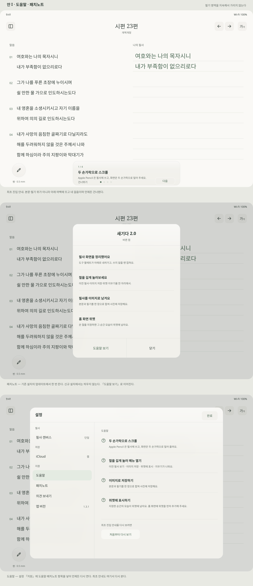

[SVG 원본](assets/help-patchnote-option-i.svg). 세 프레임이다 — 최초 진입 안내, 패치노트, 설정 안의 도움말.

최초 진입 안내는 네 걸음이고 각 걸음마다 건너뛸 수 있다 — 두 손가락 스크롤, 절 롱탭 메뉴, 이미지 저장, 위젯 지정과 홈 화면 추가.

**고친 것.** 안내 카드가 4절 본문 세 줄을 덮고 있었다(y 556~708). 카드를 팔레트가 비워 둔 하단(y 700~812)으로 내려 본문 위에 겹치지 않게 했다. 필기를 시작하면 접히는 동작도 함께 정한다. 네 걸음을 첫 진입에 모두 보여줄지, 처음에는 스크롤·롱탭만 두고 이미지·위젯은 처음 쓸 때 안내할지도 정한다 — 도움말에는 네 항목을 모두 둔다(로드맵의 "한 흐름으로 정리한다" 는 도움말 쪽 요구다).

패치노트는 기존 설치의 업데이트에서 한 번 뜨고 신규 설치에서는 띄우지 않는다(로드맵 제안 기본값). `도움말 보기` 로 이어진다.

**설정 `지원` 에 `도움말` 과 `패치노트` 를 넣었다.** 둘 다 언제든 다시 열 수 있어야 하고, 최초 안내도 도움말 아래 `처음부터 다시 보기` 로 다시 본다. 안 F 의 설정 목록도 이에 맞춰 다시 그렸다.

#### 다크 모드 · 종이 유지 — 안 J

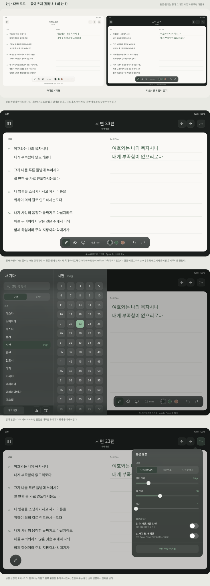

[SVG 원본](assets/dark-paper-option-j.svg). 8-1 의 안 1 을 그린 것이다. 네 프레임이다 — 라이트와 다크 나란히, 필사 화면, 탐색 열림, 본문 설정 팝오버.

원문·필기 영역은 종이 그대로이고 헤더·바깥 여백·떠 있는 도구만 어두워진다. 색은 3-1 토큰의 다크 값이다 — `canvas` `#1B1F1D` · `surface` `#2A302D` · `ink` `#E8EAE7` · `secondary` `#A3ABA5` · `accent` `#8FB79A` · `selected` `#37443C`. 책상 위 대비는 잉크 13.77:1 · 보조 7.08:1 · 강조 7.46:1, 어두운 표면 위는 11.13 · 5.72 · 6.03 이다. 보조 글자는 선택 배경(4.34:1) 위에 쓰지 않는다.

**종이는 배경 장식이어야 한다.** 다크에서 종이를 카드처럼 띄우더라도 원문·필기 열의 x 와 폭은 라이트와 같아야 한다. 종이가 레이아웃 컨테이너가 되어 안쪽 여백이 생기면 테마를 바꿀 때마다 필기 열 폭이 달라지고, 그것이 곧 reflow 자극이다(단일 Canvas 설계 §9).

**떠 있는 팔레트의 검정 색 동그라미는 어두운 표면 위에서 1.16:1 로 묻힌다.** 모든 색 동그라미에 밝은 테두리를 둘렀다. 펜 색 자체는 종이 위에 쓰이므로 바꾸지 않는다.

**비용은 밤의 밝기다.** 종이 `#FAF9F6` 과 책상의 대비는 15.83:1 이다. 화면 대부분이 종이라 어두운 방에서는 여전히 눈에 띈다. 안 1 을 고르면 이 몫을 받아들인다. 따라서 패치노트·도움말에서 **완전한 야간 필사 화면처럼 소개하지 않는다.** 어두워지는 것은 주변 UI 다.

#### 광고 자리 — 안 K

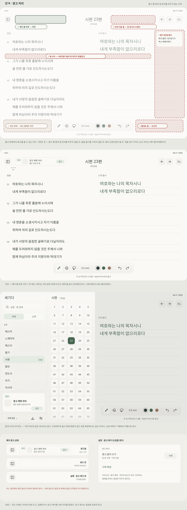

[SVG 원본](assets/ads-option-k.svg). 네 프레임이다 — 필사 화면 자리 지도, 헤더 줄 배너, 탐색 사이드바 하단 광고, 상태와 광고 제거.

필사 화면에서 상시 광고 자리를 고른 기준은 셋이다.

1. **필기 열 폭과 절의 세로 위치를 바꾸지 않는다.** 폭이 줄면 기존 필기가 축소 재배치되고, 절 사이에 무언가가 끼면 아래 절이 밀린다.
2. **말씀과 필기를 가리지 않는다.**
3. **펜과 오른손에서 멀다.** 팔레트나 이전·다음 옆은 누르려던 것 대신 광고를 누르게 된다.

| 자리 | 판정 | 이유 |
| --- | --- | --- |
| 헤더 줄 좌측 | ○ 추천 | 셋을 모두 지킨다. 헤더는 본문 위에 떠 있고 제목 줄 높이 안에 들어간다 |
| 하단 좌측 | △ | 축소 팔레트 자리와 겹치고 원문 위에 뜬다 |
| 이전·다음 옆 | × | 장을 넘기다 누른다 |
| 필기 열 옆 세로 배너 | × | 필기 열 폭이 줄어 기존 필기가 축소 재배치된다 |
| 절 사이 | × | 아래 절이 밀려 획 위치가 흔들린다 |
| 팔레트 옆 | × | 오조작. 오른손이 놓이는 자리다 |

헤더 줄 광고는 320 × 50 이고 서재 버튼과 24pt 떨어뜨렸다. 확인한 제약이 셋 있다.

- **헤더 높이가 바뀌면 안 된다.** `CarveDetailView` 는 측정한 헤더 높이를 본문 위 여백과 본문 시작점으로 쓴다. 광고가 로드되거나 실패해 헤더가 커지고 작아지면 본문 시작점이 움직인다. 헤더 높이를 고정하거나 광고를 측정 밖 오버레이로 둔다.
- **세로 화면에는 들어가지 않는다.** 820pt 폭에서는 제목과 겹친다. 세로에서는 헤더 광고를 숨기고 사이드바 광고만 두는 것을 제안한다.
- **왼손 사용자용 화면에서는 필기 열이 왼쪽으로 온다.** 첫 줄을 쓰는 손이 헤더 좌측에 닿을 수 있어 확인이 필요하다. 광고가 Apple Pencil 탭을 받지 않게 할지도 함께 본다.

사이드바 하단은 기존 차트와 같은 네이티브 광고다. 오버레이라 필사 폭에 영향이 없고 세로 화면에서도 같은 자리에 있다. 성경 목록은 13행에서 9행으로 준다. 현재 앱에 설정된 광고 단위는 차트의 네이티브 하나뿐이므로, 헤더 자리를 배너로 채우면 배너 단위를 새로 만들어야 한다. 네이티브를 헤더 높이에 맞춰 직접 배치할 수도 있다.

상태는 셋이다 — 로드 전에는 자리만 비워 두고, 실패하거나 광고 제거를 사면 자리를 없앤다.

**실제 소재는 시안의 중립적인 플레이스홀더보다 눈에 띈다.** 헤더 줄 광고는 말씀 제목과 시선을 다툴 수 있다는 지적이 있었고, 시각 디자인만 보면 헤더를 비워 두는 쪽이 낫다. 다만 안 K 의 구성을 그대로 유지하기로 했으므로(8-2), 실제 소재를 한 번 넣어 보고 다시 판단한다.

#### 헤더 축소 — 안 L

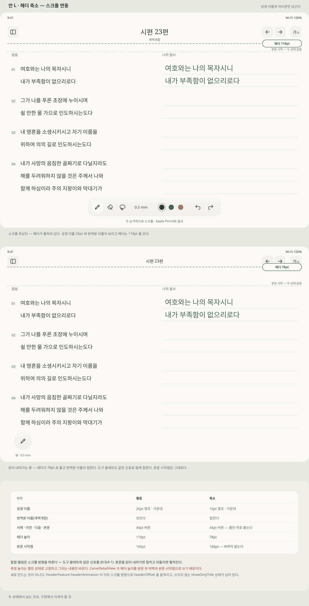

[SVG 원본](assets/header-collapse-option-l.svg). 세 프레임이다 — 헤더 펼침, 헤더 축소, 두 상태 규칙.

스크롤을 따라 헤더가 118pt 에서 78pt 로 줄고 번역본 이름이 접힌다. 성경 이름은 26pt 명조에서 16pt 로 작아지고 버튼 줄이 위로 붙는다. 도구 팔레트도 같은 스크롤 신호로 접고 펼치는 것이 목표이며, 하단 팔레트 적용 작업에서 연결한다(4-1).

**확정 (2026-09-11). 헤더는 완전히 숨기지 않는다.** 기존 본문 탭의 헤더 보임/숨김 동작은 **펼침 ↔ 축소**로 바꾼다. 스크롤과 탭 모두 상단에 축소 헤더가 남으며, 헤더 전체를 화면 밖으로 이동시키지 않는다. 광고를 배치할 예정이므로 축소를 광고 영역까지 숨기는 동작으로 해석하지 않는다. 이 결정은 L2·L3 SVG의 이전 설명보다 우선한다.

축소 시 헤더 버튼의 아이콘과 표면도 함께 작아진다. 현재 구현은 펼침 대비 **86%**(44pt → 약 38pt)이며, 터치 영역은 두 상태 모두 **44pt**를 유지한다.

**측정 높이는 펼친 상태로 고정하고 그리는 내용만 바꾼다.** `CarveDetailView` 는 측정한 헤더 높이를 본문 위 여백과 본문 시작점으로 쓴다. 헤더의 실제 프레임이 줄면 본문 시작점이 움직이고 그것이 곧 레이아웃 재계산이다. 얻는 것은 본문 영역이 넓어지는 것이 아니라 읽는 동안 시야가 트이는 것이다.

**구현 상태 (2026-09-11).** `HeaderFeature.headerAnimation`은 스크롤 방향에 따라 축소 진행량을 계산하고, `toggleCompact`는 탭 전환을 처리한다. `HeaderView`는 진행량으로 제목·버튼 크기와 위치를 바꾸며 전체 헤더를 숨기던 오프셋은 제거했다. 헤더 테스트 8개와 CarveFeature 전체 211개가 iPad 시뮬레이터에서 통과했다. 실제 기기의 전환 모양과 광고 배치는 별도 확인 대상이다.

**광고 배치 후에도 헤더가 남아야 한다.** 안 K의 구체적인 광고 위치·크기는 광고 작업에서 정하되, 축소 상태에도 광고를 표시할 공간을 확보한다. 광고 로드·실패·광고 제거로 본문 시작점이 변하지 않아야 한다. 현재 78pt는 축소 헤더 규격이며 실제 광고가 이 공간에 맞는지는 아직 검증하지 않았다.

#### 디자인 규격 · 다크 모드

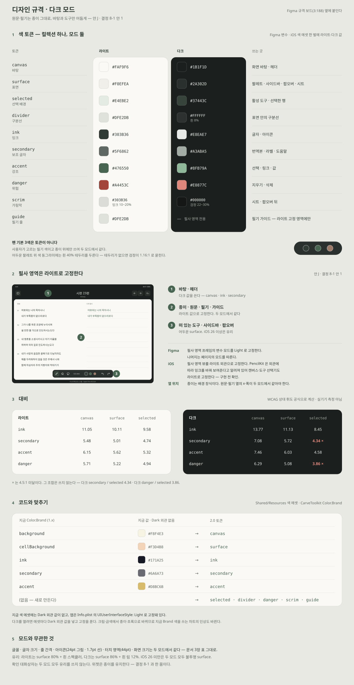

[SVG 원본](assets/design-spec-dark.svg). Figma 규격 보드(3:188) 옆에 붙이는 판이다 — 색 토큰 라이트·다크, 라이트로 고정하는 영역, 대비, 코드와 맞추기, 모드와 무관한 것. 값과 규칙은 3-1 과 같다.

#### 아이콘

모두 24pt 그림 · 1.7pt 선이고, 버튼은 44pt 정사각이다. 낱장 파일은 6-1 에 있다.

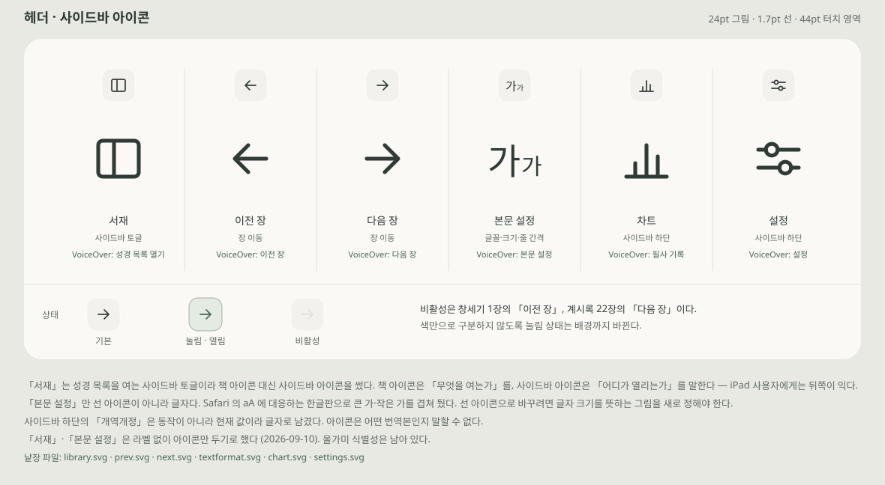

[SVG 원본](assets/header-icons.svg). 실제 크기·3배 확대·상태 셋(기본 · 눌림 · 비활성)과 VoiceOver 이름을 함께 적었다. 비활성은 창세기 1장의 `이전 장`, 계시록 22장의 `다음 장` 이다. 색만으로 구분하지 않도록 눌림 상태는 배경까지 바뀐다.

정한 것 셋이다.

- `서재` 는 성경 목록을 여는 사이드바 토글이라 책 아이콘 대신 사이드바 아이콘을 썼다. 책 아이콘은 "무엇을 여는가"를, 사이드바 아이콘은 "어디가 열리는가"를 말한다 — iPad 사용자에게는 뒤쪽이 익다.
- `본문 설정` 만 선 아이콘이 아니라 글자다. Safari 의 `aA` 에 대응하는 한글판으로 큰 가·작은 가를 겹쳤다. 선 아이콘으로 바꾸려면 글자 크기를 뜻하는 그림을 새로 정해야 한다.
- 사이드바 하단의 `개역한글` 은 동작이 아니라 현재 값이라 글자로 남겼다. 아이콘은 어떤 번역본인지 말할 수 없다.

`서재` 와 `본문 설정` 은 **라벨 없이 아이콘만 두기로 했다**(2026-09-10 사용자 결정). 올가미 식별성은 남아 있다.

### 6-3. SVG 수정본 가져오기 (2026-09-10)

**이번 수정본은 [프레임별 미리보기](assets/figma-preview.html)에서 확인한다.** 기존 보드는 비교·설명용이고, 이번의 왼손 팝오버·접힘 실행 취소·탐색 제목 수정은 프레임 파일을 기준으로 한다.

- **드래그앤드랍 권장:** `assets/figma-outlined/*.svg` 33개. 필기 샘플 63줄을 실제 **Nanum Pen Script(나눔 펜)** 글꼴의 벡터 윤곽선으로 변환했다. 필기 글꼴이 설치되지 않아도 같은 모양으로 들어간다. UI와 성경 원문은 텍스트다.
- **필기 문장을 수정할 원본:** `assets/figma/*.svg`. [나눔 펜 글꼴](assets/fonts/NanumPenScript-Regular.ttf)을 설치하면 필기 샘플 텍스트를 편집할 수 있다. 기존 나눔바른펜 대신 초기 Figma 시안의 나눔 펜 계열로 맞췄다. 글꼴은 [Google Fonts 원본](https://github.com/google/fonts/tree/main/ofl/nanumpenscript)이며 [OFL 라이선스](assets/fonts/OFL.txt)를 함께 보관한다.
- **기본 화면:** [가로](assets/figma-outlined/m2-base-landscape.svg) · [세로](assets/figma-outlined/m1-base-portrait.svg). 기존 M1·M2를 보존해 현행 헤더·도구 아이콘과 여러 줄 가이드를 사용한다.
- **왼손 설정:** [추가 시안](assets/figma-outlined/d3-left-text-settings.svg). 서재는 왼쪽에 유지하고 본문 설정만 그 옆에서 열린다. 이전·다음은 오른쪽에 유지한다. 사이드바 전체를 반전하지 않는다. 팝오버를 연 상태에서 왼손 설정을 바꿀 때는 위치가 갑자기 이동하지 않도록 닫은 뒤 재배치하는 방식을 구현 시 검토한다.
- 화면 문구는 해요체로 정리했다. 성경 원문과 보드의 개발 설명은 문체 변경 대상이 아니다. 기록은 **탭 즉시 전환**을 유지하고, 하단 문구에도 즉시 바뀐다는 점을 명시한다.
- 축소 팔레트에 44pt 실행 취소를 추가했다. 광고 위치·크기·구성은 변경하지 않았다. 탐색 중 가려지는 상세 제목은 C1·J2에서 숨겼다.
- `본문 모양 초기화`는 글꼴·크기·줄 간격·자간만 되돌리는 의도다. 입력 방식 토글은 유지한다.

재생성: `fonttools`가 있는 Python 환경에서 `python3 docs/design/export-handwriting.py`를 실행한다. 원본 `figma` 폴더를 입력으로 읽고 `figma-outlined`를 갱신한다. 앱 의존성과는 무관한 디자인 내보내기 도구다. 윤곽선 버전의 필기는 도형이므로 문장 수정은 원본에서 한 뒤 다시 내보낸다.

전체 33개 내보내기와 PNG 렌더를 확인했다. Figma 실제 드래그앤드랍 결과, 실기기 터치와 애니메이션은 미검증이다. 렌더 검증은 앱 동작 검증을 대신하지 않는다.

### 6-4. Figma 반영 상태

원본 파일에는 초기 프레임이 있다 — 가로 필사([2-13](https://www.figma.com/design/3pK0VeufxgwGfzXzcMpvuH?node-id=2-13)) · 세로 필사([2-14](https://www.figma.com/design/3pK0VeufxgwGfzXzcMpvuH?node-id=2-14)) · 절 롱탭([3-102](https://www.figma.com/design/3pK0VeufxgwGfzXzcMpvuH?node-id=3-102)) · 지우기 확인([3-165](https://www.figma.com/design/3pK0VeufxgwGfzXzcMpvuH?node-id=3-165)) · 디자인 규격 보드([3-188](https://www.figma.com/design/3pK0VeufxgwGfzXzcMpvuH?node-id=3-188)). 사용자가 옮긴 [후속 파일](https://www.figma.com/design/JO5f1y9ssusETb5geY4nUo?node-id=0-1)의 내부 구조는 확인하지 않았다.

SVG 제작 당시 MCP 호출 한도에 도달해 API 반영을 진행하지 못했다. 이후 사용자가 직접 드래그앤드랍했다고 확인했다. 후속 파일 조회는 현재 연결 계정의 접근 권한 오류로 실패했으므로, 가져오기 결과가 원본과 같다고 판정하지 않는다. 플랜의 한도 수치·갱신 시점은 이 문서의 디자인 규격에 포함하지 않는다.

새로 가져올 때는 6-3의 `figma-outlined` 파일을 사용한다. 이미 가져온 프레임을 자동으로 갱신하는 동기화 기능은 없으며, 사용자가 해당 프레임을 교체해야 한다.

**임포트 직후 상태가 iOS 26 미만 폴백이다.** SVG 에는 배경 블러를 담을 방법이 없어 유리 표면을 불투명 `#F0EFEA` 로 넣었고, 이 상태가 4-2 표의 폴백 경로와 같다. iOS 26 쪽을 보려면 `표면 (불투명 …)` 레이어를 골라 채우기를 80% 로 낮추고 Background blur 20 을 준다. 레이어 이름에 이 절차를 적어 두었다. `유리 하이라이트 (iOS 26)` 레이어는 스펙큘러와 림 라이트이며 폴백에서는 숨긴다.

임포트한 결과는 벡터 그림이다. Auto Layout · 컴포넌트 · 변수 · 프로토타입 연결은 포함되지 않으므로 Figma 안에서 다시 구성한다. UI·성경 원문 글꼴은 설치된 것으로 대체될 수 있다. 필기 샘플은 `figma-outlined` 버전에서 나눔 펜 윤곽선으로 고정했다.

다시 만든 것이 둘 있다. 헤더와 사이드바 하단을 아이콘으로 바꾸면서 `c1`~`c3` 을, 축소 팔레트를 64pt 원으로 고치면서(앞선 SVG 는 128 × 64 알약이었다) 축소 팔레트가 들어간 프레임을 다시 만들었다. 이미 Figma 에 넣은 것이 있으면 다시 끌어다 놓거나 해당 도형만 바꾸면 된다.

## 7. 구현 전 검토와 완료 기준

- **레이아웃:** 긴 절·소제목·큰 글자·가로·세로·좁은 창에서 실제 줄바꿈과 가이드 수가 대응하고, 본문·필기·팔레트가 겹치지 않는지 확인한다.
- **기존 필기 보존:** 회전·글자 크기·사이드바 너비 변경으로 기존 획의 좌표와 절 귀속이 달라지지 않아야 한다. 시안의 줄 간격을 저장 데이터에 그대로 적용하지 않고 [단일 Canvas 설계](../single-canvas-design.md)의 보존 규칙에 맞춘다.
- **접근성:** 대비, 44pt 이상 터치 영역, VoiceOver 이름, 색상 외 선택 표시, 실행 취소·다시 실행 비활성 상태를 검증한다. 본문 큰 글꼴 시안과 앱 전체 Dynamic Type 대응을 구분한다.
- **재질:** 투명도 줄이기·대비 늘리기에서 유리가 불투명 표면으로 떨어지는지, 짙은 필기 위에서 팔레트 글자 대비가 유지되는지, 동작 줄이기에서 접기·펼치기 전환이 대체되는지 확인한다. iOS 26 미만 기기에서 폴백 경로를 함께 확인한다.
- **팔레트 상태:** 접힘·펼침 전환이 도구·색·선 굵기 선택을 잃지 않는지, 접힘 상태에서도 실행 취소가 한 번 탭으로 동작하는지, 스크롤 중 접히는 동작이 두 손가락 스크롤·절 롱탭과 충돌하지 않는지 확인한다.
- **탐색:** 성경·장 목록의 긴 이름·현재 선택·재진입 복원과 장 전환 중 저장을 확인한다. 한국어·영어 번역본에서 같은 레이아웃을 검토한다.
- **본문 설정:** 글꼴·크기·줄 간격·자간을 슬라이더 양 끝까지 움직였을 때 본문이 실시간으로 다시 흐르는지, 그 과정에서 기존 획이 [단일 Canvas 설계](../single-canvas-design.md)의 reflow 규칙대로 따라오는지 확인한다. 팝오버가 열린 채 값이 바뀔 때 뒤 화면이 매 프레임 다시 그려지는 비용도 본다. 왼손 설정을 켜고 끌 때 열 순서와 기존 획의 절 귀속이 유지되는지 확인한다.
- **발견성:** 두 손가락 스크롤·절 롱탭 안내는 HELP와 연결하고 필기 공간을 지속적으로 가리지 않는다.
- **이전 필사 기록:** 회차가 많을 때 팝오버 스크롤, 긴 절·짧은 절에서 썸네일 비율, 회차를 고른 뒤 화면이 실제로 바뀌는지, 현재 회차 표시가 전환을 따라오는지 확인한다. 손상된 회차가 목록 전체를 막지 않아야 한다.
- **앱 설정:** 시트를 연 채 회전·분할 화면에서 2단이 유지되는지, 삭제 확인이 실수로 통과되지 않는지, 삭제 진행 중 조작이 막히는지 확인한다.
- **이미지 저장:** 긴 절·소제목 있는 절·필기가 없는 절에서 이미지가 잘리지 않는지, 절 경계를 넘는 획이 이웃 절 필기를 끌고 오지 않는지, 편집 중 저장이 일관된 결과를 내는지 확인한다. 사진 권한 거부·생성 실패에서 안내가 뜨는지도 본다.
- **위젯:** **라이트와 다크 양쪽에서** 확인한다(WIDGET-0 에서 다크 깨짐 확인). 미지정·재지정 교체·원본 삭제 후 동작, 긴 절, 이미지 면적 상한 초과 시 플레이스홀더로 남지 않는지, 위젯을 탭해 앱으로 돌아왔을 때 진행 중 편집이 유실되지 않는지 확인한다.
- **차트:** 가로·세로·대각선 드래그가 서로를 막지 않는지, 좌우 버튼으로도 주가 넘어가는지, 회전 후 페이지 폭이 맞는지 확인한다. 기록 없음·하루만 있음·한 주 가득에서 축과 타일이 무너지지 않아야 하고, 큰 글자에서 타일 문구가 잘리지 않아야 한다. 접근성 요약이 실제 값과 일치하는지 확인한다.
- **도움말·패치노트:** 안내가 필기 영역을 지속해서 가리지 않는지, 건너뛴 뒤 다시 뜨지 않는지, 설정에서 다시 열리는지 확인한다. 신규 설치와 업데이트를 구분하는 기준을 구현 전에 정하고, 이전 확인 버전이 없는 기존 사용자를 어떻게 다룰지도 함께 정한다(로드맵).
- **다크 모드:** 라이트↔다크 전환에서 원문·필기 열의 x 와 폭이 그대로인지(reflow 가 일어나지 않는지), 떠 있는 도구·팝오버의 대비와 색 동그라미 테두리를 확인한다. 필사 영역(종이·원문·PencilKit 캔버스·도구 선택기)이 다크에서도 라이트 외관으로 그려지고 필기 색이 바뀌어 보이지 않는지 확인한다.
- **광고:** 로드·실패·광고 제거에서 헤더 높이와 본문 시작점이 변하지 않는지, 세로 화면·왼손 모드에서 오조작이 없는지, VoiceOver 순서에서 광고가 성경 목록보다 앞서지 않는지 확인한다. 광고 제거를 붙이면 구매·복원·환불 반영·오프라인 권한을 로드맵 기준대로 확인한다.
- **글자 크기:** 설명·힌트·날짜가 3-2 의 "UI 주로 14pt" 보다 작게 그려져 있다. 현재 편집 원본 33개를 XML로 집계하면 전체 텍스트 1,516개 중 12pt 이하가 347개(약 22.9%), 11pt 이하가 77개다. 이 수치는 상태바·보드 설명·숨긴 글자도 포함해 순수 UI 설명만의 비율은 아니다. 설명·힌트는 13pt, 목록 날짜는 15pt 부터 비교하고 Dynamic Type 에서 어디까지 커지는지 확인한다.
- **문구:** 화면 문구는 **해요체로 통일한다**(2026-09-10 결정). 지금 앱은 대부분 합쇼체(`필사 내역이 없습니다`)라 기존 문구도 함께 고쳐야 한다. 시안 문구는 해요체로 바꿨다. 실패 안내에는 사라지는 토스트만 두지 않고 `다시 시도` 를 함께 둔다.
- **미제작 범위:** 좁은 창, 다크 모드 안 2(어두운 종이), 세로 화면의 나머지 화면은 후속 범위다.

### 7-1. 현재 SVG 사이에 남아 있는 차이

| 항목 | 현재 파일 상태 | 후속 처리 |
| --- | --- | --- |
| 라이트·다크 본문 설정 | D1·D3는 350 × 560pt, 가림막 없음. J3는 이전 팝오버 크기와 `scrim`이 남아 있음 | 다크에서도 원문 미리보기가 잘 보이도록 D1과 맞추기 |
| 탐색 제목 | C1·J2는 숨김, 광고 K3는 기존 구성 유지 | 광고 배치는 유지하면서 통합 화면의 헤더 표시를 결정 |
| 위젯 비교 | G4에 종이 유지·어두운 반전 두 후보와 미결정 캡션이 남아 있음 | 제품 결정은 8-1의 종이 유지. 반전 그림은 비교용으로만 사용 |
| 이전 필사 썸네일 | E2는 같은 한 줄 문장을 세 번 보여줌 | 탭 즉시 전환은 유지하고 긴 절·부분 필사 예시 보강 |
| 큰 글꼴·좁은 창 | 큰 글꼴은 초기 보드 예시, 최신 33개 프레임에는 독립 큰 글꼴 화면이 없음 | 현행 버튼·팔레트 기준 큰 글꼴과 좁은 창 시안 추가 검토 |
| UI 글꼴 | 가져오기용도 UI·원문은 텍스트 | Figma에서 글꼴 대체와 줄 넘침 확인 |

이 표는 문서를 SVG에 맞추기 위해 남긴 현재 상태다. SVG 자체를 수정하거나 이미 확정한 광고·회차 선택 정책을 바꾼 것이 아니다.

## 8. 결정이 필요한 것

시안은 대략 완성됐다. 아래는 구현 전에 정해야 하는 것이다. 각 항목에 선택지·영향·추천을 적었고, **추천은 결정이 아니다.**

### 8-1. 다크 모드에서 필기 색

**문제.** 검정 펜으로 쓴 필기는 어두운 배경에서 보이지 않는다.

확인한 사실은 다음과 같다.

- **앱은 지금 라이트로 고정돼 있다** — [InfoPlist.swift](../../Plugins/ProjectDescriptionHelpers/InfoPlist.swift) 의 `UIUserInterfaceStyle: Light`. 그래서 지금까지 이 문제가 없었다. 다크를 열면 **기존 사용자 전원의 모든 필기**가 대상이 된다.
- 펜 기본 색은 **검정 · 파랑 · 빨강**이다(`PencilPalatteFeature.palatteColors`). 사용자가 길게 눌러 바꿀 수 있고 `appStorage` 에 남는다.
- 획의 색은 `PKDrawing` 안에 값으로 박혀 저장된다.

어두운 종이 `#262C29` 위 대비를 계산했다(WCAG 공식, 실기기 측정 아님).

| 펜 색 | 종이 `#FAF9F6` 위 | 어두운 종이 위 | 명도만 뒤집으면 |
| --- | --- | --- | --- |
| 검정 `#000000` | 19.95:1 | **1.47:1** | 밝은 회색 10.27:1 |
| 파랑 `#007AFF` | 3.82:1 | 3.54:1 | 밝은 파랑 6.70:1 |
| 빨강 `#FF3B30` | 3.37:1 | 4.01:1 | 밝은 빨강 6.25:1 |

**앱의 기존 원칙이 답의 절반을 준다.** [단일 Canvas 설계](../single-canvas-design.md) §9 는 reflow 를 "표시 시점에만 적용하고 저장하지 않는다" 고 정했다. 색도 같은 규칙을 따른다 — **저장된 색은 건드리지 않고 보여줄 때만 바꾼다.** 라이트로 돌아오면 원래 색이다. 이 전제는 세 안 모두에 공통이다.

| 안 | 내용 | 좋은 점 | 비용 |
| --- | --- | --- | --- |
| **1. 필사 영역은 종이 유지** | 사이드바·팔레트·설정·차트만 다크. 원문·필기 영역은 밝은 종이 | 색 변환이 없다. 기존 필기·이미지·위젯 모두 영향 없음. 종이 은유와 맞다 | 밤에 화면 대부분이 여전히 밝다. 다크를 켜는 이유의 절반을 못 준다 |
| **2. 어두운 종이 + 명도 반전** | 색상은 유지하고 명도만 뒤집어 표시. Apple 이 같은 문제를 위한 `PKInkingTool.convertColor(_:from:to:)` 를 제공하는 것으로 알려져 있다(구현 전 확인) | 진짜 다크 모드 | ① 변환 사본으로 캔버스를 바꾸면 컨트롤러가 `renderedRevision` 변화마다 실행 취소를 비운다(단일 Canvas 설계 §9) — **라이트↔다크 전환 때 실행 취소가 날아간다.** ② 이미지·위젯을 어느 쪽으로 낼지 또 정해야 한다. ③ 사용자가 고른 색과 화면의 색이 달라 보인다 |
| **3. 사용자 선택** | 설정에 "다크에서 필사 배경": 종이 유지 / 어두운 종이 | 둘 다 준다 | 설정이 하나 늘고 두 경로를 모두 검증한다 |

**결정 (2026-09-10): 안 1 을 채택한다.** 안 J(6-2)를 보고 정했고 규격은 3-1 에 넣었다. 2.0 범위가 이미 크고, 안 2 는 실행 취소 소실과 이미지·위젯 이중화 때문에 회귀 표면이 reflow 다음으로 크다. 안 1 도 UI 는 다크가 되므로 다크 모드 지원이라고 말할 수 있다. **위젯 다크도 종이 유지로 따라간다** — 둘을 따로 정하지 않는다.

안 2 로 간다면 추가로 정할 것 — 변환 규칙(`convertColor` 를 그대로 쓸지), 편집 중 테마 전환을 막을지 실행 취소를 비울지, 이미지 저장을 항상 라이트로 낼지(공유물은 종이가 맞다고 본다), 팔레트 색 동그라미도 변환해 보여줄지.

**별개로 지금 어긋나 있는 것.** 시안의 펜 색(검정 · 초록 `#476550` · 갈색 `#9D7967`)은 코드의 기본값(검정 · 파랑 · 빨강)과 다르다. 2.0 의 기본을 어느 쪽으로 할지 정한다. 기본 빨강은 **라이트에서도 3.37:1** 로 약하다는 점도 같이 본다.

### 8-2. 광고 위치

**결정 (2026-09-10).** 탐색 사이드바 하단 광고는 채택한다 — 기존 차트와 같은 네이티브다. 장 완료 화면은 만들지 않는다. 필사 화면 상시 광고는 자리를 검토 중이며 안 K 의 헤더 줄 좌측이 후보다.

**로드맵과의 관계.** [로드맵 §4](../release-2.0.0-roadmap.md) 는 첫 후보로 **광고 제거 일회성 구매** 또는 **필사를 명시적으로 끝낸 결과 화면의 광고**를 들고, **필사 중 상시 배너와 장 전환마다 전면 광고는 우선순위에서 제외**했다. 장 완료 화면을 만들지 않으므로 결과 화면 후보는 빠진다. 필사 화면 상시 광고를 채택하면 제외 문장을 뒤집는 것이라 로드맵도 함께 고쳐야 한다 — 이 문서는 로드맵을 고치지 않았다. 민감 카테고리 차단과 최대 콘텐츠 등급 G 는 그대로 따른다.

**필사 영역 옆 상시 배너가 이 앱에서 특히 나쁜 이유.** 배너가 필기 열 폭을 줄이면 기존 필기가 축소 재배치된다 — 단일 Canvas 설계 §9 의 "writing width 감소 → 종횡비 유지 uniform 축소". 광고가 늦게 뜨거나 실패해 크기가 변할 때마다 다시 흐른다. 다른 앱에는 없는 비용이고 1장의 "차분한 필사 경험" 과도 부딪힌다. 그래서 광고는 **머무는 동안이 아니라 필기하지 않는 순간**에 붙인다.

| 자리 | 필사 폭 영향 | 노출 | 판정 |
| --- | --- | --- | --- |
| 탐색 사이드바 하단 | 없음 — 오버레이 | 장을 바꿀 때마다 | **채택.** 성경 목록이 13행에서 9행으로 준다 |
| 차트 스폰서 타일 | 없음 | 차트를 열 때 | 현재 있음. 유지 |
| 필사 화면 헤더 줄 좌측 | 없음 — 헤더 줄 안 | 항상 | 검토 중 (안 K) |
| 이미지 저장 직후 | 없음 | 드묾 | 수익 기여가 작다 |
| 장 완료 화면 | 없음 | 장을 끝낼 때 | 만들지 않는다 |
| 필사 영역 옆 상시 배너 | **reflow 유발** | 높음 | 쓰지 않는다 |
| 팔레트 근처 · 이전·다음 옆 | 없음 | 높음 | 오조작. 쓰지 않는다 |
| 장 전환마다 전면 | 없음 | 높음 | 쓰지 않는다 |

**광고 제거 구매를 붙일지.** 결제를 권하는 기능을 만들 생각은 없었다는 전제에서 판단했다.

- **필사 화면에 상시 광고를 넣으면 사실상 필요하다.** 핵심 화면에 끌 수 없는 광고가 붙으면 불만이 리뷰로 간다. 끄는 길이 있으면 같은 광고가 참을 만한 것이 된다. 성경 본문 가까이 광고가 붙는 것 자체를 꺼리는 사용자에게도 답이 된다.
- **사이드바·차트에만 두면 선택이다.** 필기하지 않는 자리라 불편이 작고 나중에 붙여도 된다.
- **권유하지 않아도 된다.** 설정에 한 줄과 구매 복원만 둔다. 팝업·배너로 결제를 권하지 않는다(안 K 네 번째 프레임).
- **비용.** StoreKit 비소모성 상품 하나, 구매·복원·환불 반영·오프라인 권한, 광고를 제거한 사용자에게 광고 SDK 를 띄우지 않는 처리, 심사에 필요한 구매 복원, 가격 결정.
- **수익 관점.** 광고 제거를 사는 사람은 가장 오래 쓰는 사람이라 광고 노출도 가장 많다. 가격은 기존 차트 광고의 노출·수익 규모를 보고 정한다 — 로드맵이 먼저 확인하라고 한 항목이다.

정할 때 같이 볼 것 — 광고 실패 시 자리를 비울지 접을지, 사이드바 광고가 VoiceOver 탐색 순서에서 성경 목록보다 앞서지 않는지.

### 8-3. 나머지 열린 결정

| 결정 | 선택지 | 묶인 것 | 막는 작업 |
| --- | --- | --- | --- |
| `.prominentDetail` 폭 유지 | 실측 결과에 따름 | 5장 탐색 구조 전체 | **DESIGN-0 종료.** 실패하면 안 C 가로가 다시 잡힌다 |
| 필사 화면 상시 광고 | 넣는다(헤더 줄 좌측) / 넣지 않는다 | 로드맵 §4 문장 · 광고 제거 구매 | 광고 범위 |
| 광고 제거 구매 | 붙인다 / 붙이지 않는다 | **필사 화면 상시 광고와 한 묶음** | 광고 범위 |
| 세로 화면의 헤더 광고 | 숨긴다(제안) / 작은 크기 | 안 K | 광고 범위 |
| 펜 기본 색 | 코드(검정·파랑·빨강) / 시안(검정·초록·갈색) | 8-1 | DESIGN-1 |
| 접힘 상태의 실행 취소 | SVG는 별도 44pt 버튼으로 반영. 비활성·터치 상태 확인 | 4-1 | DESIGN-1 |
| 왼손 모드 팝오버 프레임 | `d3-left-text-settings.svg` 제작. 실제 팝오버 적응 동작 확인 필요 | 안 D | DESIGN-1 |
| 이전 필사 썸네일 예시 | 짧은 절·긴 절·부분 필사로 다시 그린다 | 안 E | DESIGN-1 |
| 탐색 중 헤더 제목 | C1·J2는 숨김 반영. 광고 K3와 통합 시 정합성 확인 | 안 C · K | DESIGN-1 |
| 최초 안내 걸음 수 | 네 걸음 / 두 걸음 + 처음 쓸 때 안내 | 안 I · HELP | HELP |
| 설명·힌트 글자 크기 | 11~12pt 유지 / 13~15pt 로 올림 | 3-2 규격 | DESIGN-1 |
| 절 이미지 배치 | 위아래(시안) / 앱과 같은 좌우 | 안 G | IMAGE |
| 위젯용 축소 사본 | IMAGE-CORE 가 함께 만든다 / WIDGET 이 따로 | WidgetKit 면적 상한 | IMAGE-CORE |
| 신규 설치와 업데이트 구분 | 이전 확인 버전이 없는 기존 사용자를 어떻게 볼지 | 안 I 패치노트 | HELP |
| 올가미 식별성 | 아이콘 교체 / 유지 | 6장 아이콘 | DESIGN-1 |

### 8-4. 닫힌 결정

| 결정 | 내용 | 날짜 |
| --- | --- | --- |
| 배포 타깃 | iOS 17.0 유지, Liquid Glass 는 `#available(iOS 26.0, *)` 분기. iPadOS 18 사용자가 있다 | 2026-09-10 |
| 탐색 구조 | 안 C — 가로 3-column 오버레이, 세로 헤더 팝오버 | 2026-09-10 |
| 헤더·사이드바 버튼 | 아이콘. 번역본 이름만 글자 | 2026-09-10 |
| `서재` · `본문 설정` 라벨 | 아이콘만 둔다 | 2026-09-10 |
| 헤더 오른쪽 끝 이름 | `설정` 이 아니라 `본문`(본문 설정). 앱 설정은 사이드바 하단 | 2026-09-10 |
| 탐색 사이드바 하단 광고 | 채택. 기존 차트와 같은 네이티브 | 2026-09-10 |
| 장 완료 화면 | 만들지 않는다 | 2026-09-10 |
| 다크 모드 | 안 1 — 필사 영역은 종이 유지, 바탕·도구만 다크 (안 J · 3-1) | 2026-09-10 |
| 위젯 다크 | 종이 유지 — 다크 모드 결정과 한 몸 | 2026-09-10 |
| 팔레트 접힘 조건 | 시간이 아니라 스크롤 동작에 붙인다. 시간 기반 자동 접힘은 넣지 않는다 | 2026-09-10 |
| 광고 구성 | 안 K 를 그대로 유지한다. 사이드바 하단은 채택이고 헤더 줄 좌측은 계속 검토한다. "헤더를 비워 두라" 는 검토 의견은 채택하지 않았다 | 2026-09-10 |
| 화면 문구 문체 | 해요체로 통일한다 | 2026-09-10 |
| 회차 선택 흐름 | 탭이 곧 대표 회차 전환이다. 미리보기 단계를 두지 않는다 | 2026-09-10 |
| 왼손 모드의 좌우 | 사이드바는 왼쪽 고정(`NavigationSplitView` 제약). `서재` 는 왼쪽 유지, `본문 설정` 만 필기 열 쪽으로 옮긴다 | 2026-09-10 |
| 헤더 축소 | 스크롤·본문 탭 모두 펼침 ↔ 축소. 완전히 숨기지 않는다. 118pt → 78pt, 버튼 시각 크기 86%·터치 영역 44pt. 측정 높이는 펼친 상태로 고정하고 광고 표시 공간을 유지한다 | 2026-09-11 |

## 9. 다음 순서와 로드맵 연결

1. DESIGN-0: 이 문서의 기본·큰 글꼴·탐색 시안을 검토하고 본문 글꼴, 가이드 강도, 팔레트 위치, 사이드바 동작을 확정한다. 현재 상태는 방향 합의와 초안 제작이며 DESIGN-0 전체 완료로 판정하지 않는다.
2. DESIGN-0 선행 실측: `.prominentDetail` 의 폭 유지를 가로·세로 실기기에서 확인한다. 이 결과에 따라 5장의 탐색 구조가 성립하거나 다시 잡힌다.
3. DESIGN-1: 필사 화면부터 작은 단위로 구현한다. UI-1·UI-2·SAVE 작업과 저장·제스처 변경 범위를 조율한다. SVG 가져오기 후 Figma 컴포넌트와 상태를 정리한다.
4. DESIGN-2: 확정한 공통 규격을 차트·설정·안내로 확장한다.
5. 출시 통합 검증: [로드맵](../release-2.0.0-roadmap.md)의 회귀·스모크 기준을 따른다. 시안 제작이나 SVG XML 검증은 앱 회귀·실기기 검증을 대체하지 않는다.

## 10. 이번 문서화의 검증 범위

- **저장소 대조.** SVG 총 94개: 보드 17개·아이콘 11개·편집 원본 33개·가져오기용 33개. 원본과 가져오기용의 파일명·화면 크기를 대조하고 XML 파싱을 확인했다.
- **렌더 확인 이력.** 앞선 SVG 수정 작업에서 가져오기용 33개를 PNG로 렌더해 확인했다. 필기 63줄은 동봉한 Nanum Pen Script 글리프 윤곽선이며 글꼴 대체에 의존하지 않는다. 이번 갱신은 Markdown 수정과 SVG 구조 대조이며 Figma 화면을 새로 확인한 것이 아니다.
- **소스에서 확인한 사실.** 배포 타깃 iOS 17.0 · `UIUserInterfaceStyle: Light` 고정 · `.prominentDetail` 사용 · 사이드바가 열리면 detail 을 회색으로 교체하는 분기 · 장 목록이 리스트인 점 · 팔레트가 헤더 안에 있고 그 높이가 본문 시작점이 되는 결합 · `showPalatte` · `isLeftHanded` · `allowFingerDrawing` · 본문 설정 항목과 범위·기본값 · 이전 필사의 대표 회차 전환과 `isPresent` 미표시 · 썸네일 크기 처리 · 설정 화면 구성 · 차트 구성 · `Color.Brand` 값과 색 에셋에 Dark 외관이 없다는 점 · 광고 단위가 차트 네이티브 하나뿐이라는 점.
- **로드맵·WIDGET-0 근거.** 절 롱탭 네 항목 · 이미지 내용 · 위젯 정책 · CHART 결함의 원인 후보 · HELP 와 패치노트의 범위와 노출 기본값 · 위젯 다크 깨짐 · WidgetKit 이미지 면적 상한.
- **계산값.** 대비 · 터치 영역 · 한 화면에 보이는 장 수는 SVG 좌표와 WCAG 상대 휘도 공식으로 계산한 것이며 실기기 측정이 아니다.
- **확인하지 않은 것.** Liquid Glass 의 실제 동작·성능 · 제스처와 스크롤 동작 · `.prominentDetail` 의 폭 유지 · `PKInkingTool.convertColor` 의 동작 · 팝오버를 연 채 값이 바뀔 때의 리플로우 비용 · 광고 배치가 실제 광고 SDK 의 크기·정책에서 성립하는지 · Figma 임포트 결과의 레이어 구조와 글꼴 대체 · Figma 규격 보드(3-188)의 내용.
- **제안(구현·검증 전).** 절 이미지 배치 · 저장 결과 알림 형태 · 차트의 주 이동 버튼과 타일 문구 정리 · 접근성 요약 문장 · 최초 안내의 배치와 걸음 수 · 광고 자리 · 토큰 이름 매핑.

앱 코드·의존성·빌드 설정은 변경하지 않았다.
